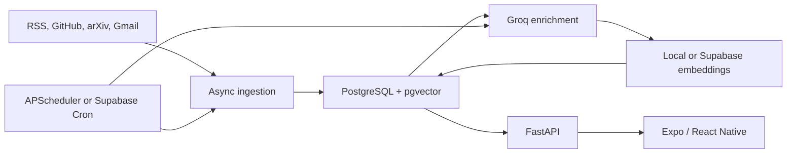

# Pulse

[](https://github.com/JustATalentedGuy/pulse/actions/workflows/ci.yml)
[](LICENSE)

Pulse is a personal AI intelligence reader for engineers and researchers. It
collects AI and software content from RSS, GitHub, arXiv, and Gmail
newsletters, enriches each item with an LLM, and serves a personalized mobile
feed with semantic search, quizzes, digests, trends, and grounded Q&A.

This repository is a sanitized public source release. It contains the complete
application and deployment configuration, but no production credentials,
OAuth tokens, database contents, or private Git history.

## Highlights

- Multi-source ingestion with normalization, deduplication, and failure isolation
- Structured Groq enrichment with summaries, categories, entities, and scoring
- Personalized ranking from reading, bookmarking, and hiding behavior
- PostgreSQL and pgvector full-text, semantic, and hybrid search
- LangGraph Socratic quizzes and corpus-grounded Ask mode
- Expo Router Android application with offline cache and network states
- Local Docker deployment and zero-cost Render + Supabase deployment path
- Database migrations, scheduled jobs, retention, encrypted backups, and tests

## Architecture



## Stack

| Area | Technology |
|---|---|
| Mobile | Expo SDK 56, React Native, Expo Router, TanStack Query, Zustand |
| API | Python 3.12, FastAPI, SQLAlchemy async, Pydantic |
| AI | Groq, LangGraph, local MiniLM or Supabase `gte-small` |
| Data | PostgreSQL, pgvector, Alembic |
| Operations | Docker Compose, Render, Supabase, GitHub Actions, EAS |

## Repository Layout

```text
backend/             FastAPI API, ingestion, enrichment, migrations, tests
mobile/              Expo Android application and component tests
docker-compose.yml   Complete local stack
render.yaml          Optional Render Blueprint for this monorepo
```

## Run Locally

Requirements: Docker Desktop, Node.js 22.13 or newer, and npm.

```powershell
Copy-Item backend\.env.example backend\.env
Copy-Item mobile\.env.example mobile\.env
```

Fill the required values in `backend/.env`. At minimum, configure the local
PostgreSQL fields, `DATABASE_URL`, `API_KEY`, source URLs, and a Groq key for
AI features. Use the same `API_KEY` as `EXPO_PUBLIC_API_KEY` in `mobile/.env`.

```powershell
docker compose up --build -d

cd mobile
npm ci
npx expo start
```

The API runs at `http://localhost:8000`. On a physical Android device, set
`EXPO_PUBLIC_API_URL` to the computer's LAN address rather than `localhost`.

Backend-only development and phase checks are documented in
[`backend/README.md`](backend/README.md). The optional free-tier cloud path is
documented in
[`backend/CLOUD_DEPLOYMENT.md`](backend/CLOUD_DEPLOYMENT.md).

## Verification

```powershell
cd backend
python -m pip install -e ".[dev,local-embeddings]"
pytest -m "not live"

cd ..\mobile
npm ci
npm run typecheck
npm test
```

Live ingestion tests call third-party services and are excluded from the
default verification command.

## Security Model

Pulse is deliberately designed for a single owner. Its static API key is a
lightweight access gate, not multi-user authentication, and values prefixed
with `EXPO_PUBLIC_` are embedded in client builds. Do not point a public build
at a private production deployment.

See [`SECURITY.md`](SECURITY.md) before deploying a fork.

## License

MIT
